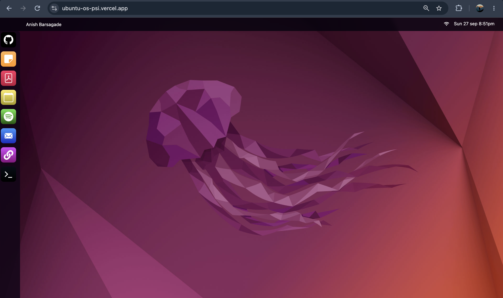
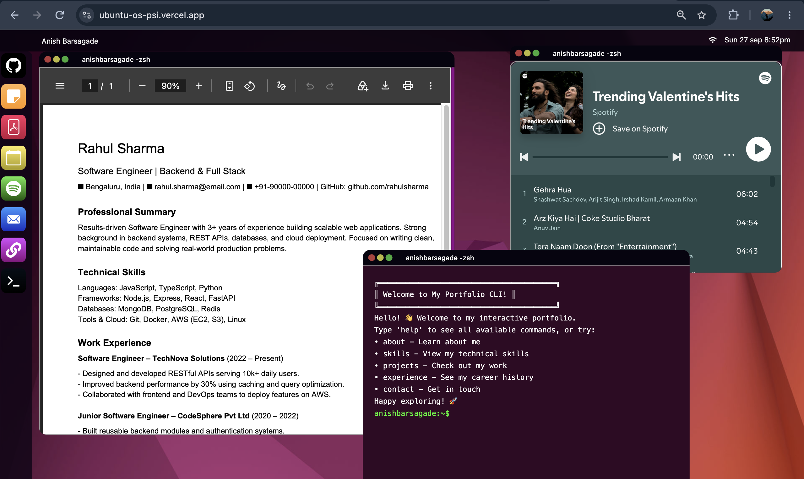

# Ubuntu OS — React

A browser-based Ubuntu-inspired desktop environment built with React.

This project recreates the feel of using an operating system inside a web browser, with draggable windows, a dock, keyboard shortcuts, and interactive app-style components.

## 🚀 Live Demo

[View the Live Demo](https://ubuntu-os-psi.vercel.app/)

## 📂 GitHub

[View the Repository](https://github.com/AnishBarsagade/ubuntu-os)

## ✨ Features

- 🖥️ Ubuntu-inspired desktop interface
- 🪟 Draggable and resizable windows
- ⌨️ Keyboard shortcuts
- 📌 Interactive dock
- 📂 App-style windows
- 🔄 Window focus and layering
- 🎨 Responsive and interactive UI
- ⚡ Built with React and Vite

## 🛠️ Tech Stack

- React
- JavaScript
- Vite
- SCSS
- React Rnd

## 📸 Preview





## ⚙️ Run Locally

Clone the repository:

```bash
git clone YOUR_GITHUB_LINK
```

Go into the project folder:

```bash
cd YOUR_PROJECT_FOLDER
```

Install dependencies:

```bash
npm install
```

Start the development server:

```bash
npm run dev
```

Then open the local URL shown in your terminal.

## 📌 About

I built this project to practice React while experimenting with creating a desktop-like user interface in the browser.

There are still some features and improvements I want to add in the future.

---

Built with React ❤️
